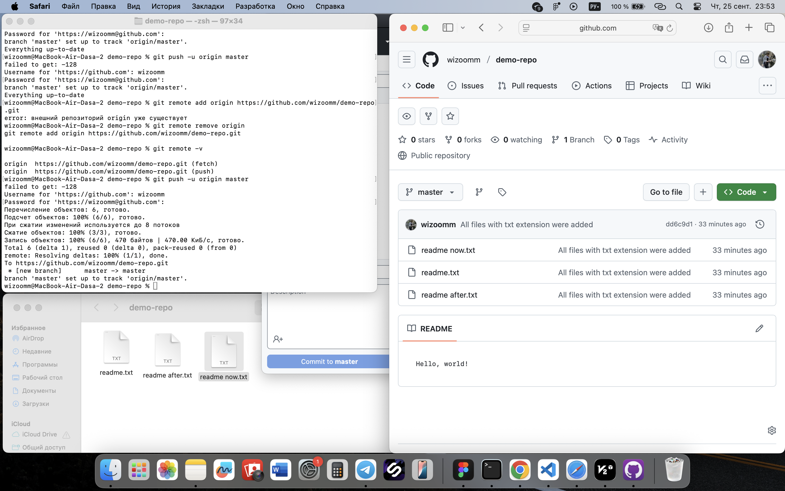

# Исследование базовых команд Git

Так как у меня минимальный опыт работы с git, я приняла решение сначала исследовать эти команды просто в терминале.

На рабочем столе была создана папка `demo-repo`. После я зашла в папку и инициализировала там пустой репозиторий Git при помощи команды `git init`. При помощи команды `ls -la` подтвердила удачную инициализацию репозитория. Командой `git status` я проверила коммиты. Вывод сказал мне «нечего коммитить».

Затем командами `touch` и `nano` был создан файл `readme.txt` с записью «Hello!». Т.к. я внесла изменения, а именно создала файлы, мне нужно было сделать первый `git add`, чтобы отслеживать изменения, а затем и первый коммит командой `git commit -m "First file"`.  
После я создала два дубликата `readme after.txt` и `readme now.txt` и сделала `git add`, а затем коммит командой `git commit -m "All files with txt extension were added"`.

Чтобы посмотреть историю всех коммитов я воспользовалась командой `git log` и `git log --summary`.

После я создала репозиторий `demo-repo` на своём GitHub и при помощи команды `git remote add origin` выгрузила туда код из своего локального репозитория.  
Производим команду выгрузки `git push -u master`.  
Для входа необходимо было создать токен.

Файлы успешно появились в репозитории на GitHub.

Затем я демонстрирую команду `pull`, для выгрузки изменений в локальный репозиторий, обратную команде `push`. Зелёным цветом мы видим информацию о том, что при изменениях появились две новые строки.

На следующем скрине показываю изменения наглядно.

Далее была создана новая папка `folder` и файл `bye.txt` внутри. После была выполнена команда, которая позволяет посмотреть пути изменения, которые были сделаны в стадии staged. 

Затем я создала новую ветку `clean_up` и переключилась на неё.

В этой ветке я удалила ненужные файлы и сделала коммит.

Затем обратно переключаюсь на ветку `master` и выполняю слияние при помощи команды `merge`, удаляю ненужную ветку `clean_up`. При помощи команды `push` выгружаю последние изменения.

---

## Вывод

Таким образом я познакомилась с базовыми командами Git при помощи терминала.

